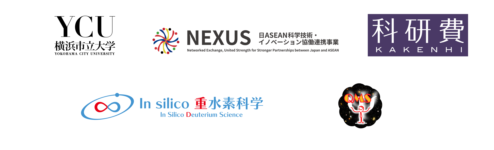

<b>The 11th Japan-Thai workshop on Theoretical and Computational Chemistry 2026 (JTTCC11)</b> will be held on <b>April 25, 2026</b> in an in-person form, at Yokohama City University (Kanazawa-Hakkei Campus), Yokohama, Japan. This workshop aims to promote international exchange of researchers and students in quantum chemistry between Japan and the Kingdom of Thailand. There will be oral and poster sessions. Oral presentations will be given by invited speakers (we will accept no contributed talks), however, <b>[we are now calling for poster presenters](https://ycuqpc.github.io/JTTCC11th/#registration)</b>. We look forward to productive discussions.

# Registration

Registration fees: Free 
If you will join the conference mixer (with a light meal and drinks), a participation fee 3,000 JPY will be applied to a non-student participant (student: free). 

Please fill out this <b>[registration form](https://forms.cloud.microsoft/Pages/ResponsePage.aspx?id=Zm1jvv7LuEGJXO5cvYvHVc-tcGV_kUpJmdA27Dig3FpUMjlEWDFQQVhaTkIzQUkwTDc1S1g1QzRNSi4u)</b> by <b>April 15, 2026</b>. 

If you are an invited speaker, you do not have to use this registration form.

# Program

<b>Saturday, April 25th, 2026</b> 

Details will be announced as soon as they are fixed. 

### Oral Session

| Start | End   |         |
| :---: | :---: | :------ |
| 9:XX | 9:XX | TBA |
|||

### Poster Session

| Start | End   |         |
| :---: | :---: | :------ |
| 17:XX | 17:XX | TBA |
|||

# Venue

### Oral Session
Room 141 (Main conference room), Arts Research Building 1F 
Kanazawa-Hakkei Campus, Yokohama City University 
Yokohama, Japan 
 
横浜市立大学 (金沢八景キャンパス) 
文科系研究棟1階　大会議室

### Poster Session &amp; Conference Mixer
Entrance hall (1F), Science Research Building 
Kanazawa-Hakkei Campus, Yokohama City University 
Yokohama, Japan 
 
横浜市立大学 (金沢八景キャンパス) 
理学系研究棟1階　エントランスホール 
 
Note that the venue is subject to change.

# Access

[Kanazawa-Hakkei Campus of Yokohama City University](https://goo.gl/maps/UwE5dQeStBsi8jVu5) is a 5-minutes walk from [Kanazawa-Hakkei Station](https://maps.app.goo.gl/mWU5TP94mPia5UZX8) of [Keikyu line](https://www.haneda-tokyo-access.com/en/).

<iframe src="https://www.google.com/maps/embed?pb=!1m14!1m8!1m3!1d13019.591406458434!2d139.5989118!3d35.333358!3m2!1i1024!2i768!4f13.1!3m3!1m2!1s0x601843fd143d2285%3A0xa2bfcf87b9aac00d!2sYokohama%20City%20University%20Kanazawa-Hakkei%20Campus!5e0!3m2!1sen!2sjp!4v1704183177009!5m2!1sen!2sjp" width="600" height="450" style="border:0;margin-bottom:30px; max-width: 100%;" allowfullscreen="" loading="lazy" referrerpolicy="no-referrer-when-downgrade"></iframe>

## Local Organizing Committee

Dean and Prof. Masanori TACHIKAWA (Graduate School of Nanobioscience, Yokohama City University) and [Quantum Physical Chemistry Laboratory, Yokohama City University](https://www-user.yokohama-cu.ac.jp/~tachi/en/).

## Acknowledgment

This workshop is organized by the [Graduate School of NanoBioScience (Yokohama City University)](https://www.yokohama-cu.ac.jp/english/academics/graduate/nanobio/index.html), [Graduate School of Medical Life Science (Yokohama City University)](https://www.yokohama-cu.ac.jp/english/academics/graduate/mls/index.html), and [NEXUS (JST)](https://www.jst.go.jp/aspire/nexus/y-tec/en/theme/2025/vol016.html), sponsored by [SPRING program (Yokohama City University)](https://www.yokohama-cu.ac.jp/spring/English/About_SPRING.html) and [Grant-in-Aid for Scientific Research(S) (MEXT, KAKENHI)](https://ycuqpc.github.io/kibanS-25H00428/), and supported by the [International Affairs Office (Yokohama City University)](https://www.yokohama-cu.ac.jp/english/global/international/index.html) and [Grant-in-Aid for Transformative Research Areas (A) (MEXT, KAKENHI)](https://lambda.phys.tohoku.ac.jp/qm-science/en/). 

