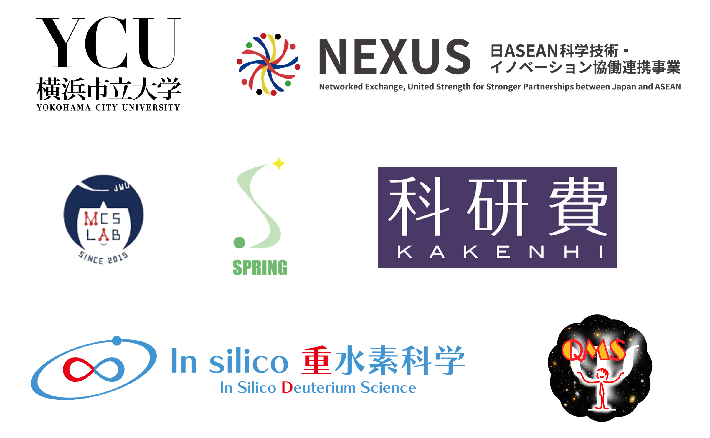

We hold this workshop in Kanazawa-Hakkei Campus of Yokohama City University on April 25th, 2026. This event will have both oral and poster presentations by invited speakers form Japan and Thailand. We look forward to productive discussions.

# Registration

TBA

# Program

Saturday, April 25th, 2026 
Room 141 (Main conference room), Arts Research Building (1F), Kanazawa-Hakkei Campus of Yokohama City University

### Oral Session

| Start | End   |         |
| :---: | :---: | :------ |
| 9:XX | 9:XX | TBA |
|||

### Poster Session

| Start | End   |         |
| :---: | :---: | :------ |
| 17:XX | 17:XX | TBA |
|||

# Access

[Kanazawa-Hakkei Campus of Yokohama City University](https://goo.gl/maps/UwE5dQeStBsi8jVu5) is a 5-minutes walk from [Kanazawa-Hakkei Station](https://maps.app.goo.gl/mWU5TP94mPia5UZX8) of [Keikyu line](https://www.haneda-tokyo-access.com/en/).

<iframe src="https://www.google.com/maps/embed?pb=!1m14!1m8!1m3!1d13019.591406458434!2d139.5989118!3d35.333358!3m2!1i1024!2i768!4f13.1!3m3!1m2!1s0x601843fd143d2285%3A0xa2bfcf87b9aac00d!2sYokohama%20City%20University%20Kanazawa-Hakkei%20Campus!5e0!3m2!1sen!2sjp!4v1704183177009!5m2!1sen!2sjp" width="600" height="450" style="border:0;margin-bottom:30px; max-width: 100%;" allowfullscreen="" loading="lazy" referrerpolicy="no-referrer-when-downgrade"></iframe>

## Organizers

TBA

## Acknowledgment

This workshop is organized by the [Graduate School of NanoBioScience (YCU)](https://www.yokohama-cu.ac.jp/english/academics/graduate/nanobio/index.html) and [NEXUS (JST)](https://www.jst.go.jp/aspire/nexus/y-tec/theme/2024/vol014.html), 
sponsored by [SPRING program (YCU)](https://www.yokohama-cu.ac.jp/spring/English/index.html) and [Grant-in-Aid for Scientific Research(S) (MEXT, KAKENHI)](https://www.jsps.go.jp/j-grantsinaid/12_kiban/ichiran_r7.html#u20250322182021), 
and supported by the [International Affairs Office (YCU)](https://www.yokohama-cu.ac.jp/english/global/international/index.html) and Grant-in-Aid for Transformative Research Areas (A) (MEXT, KAKENHI) 

